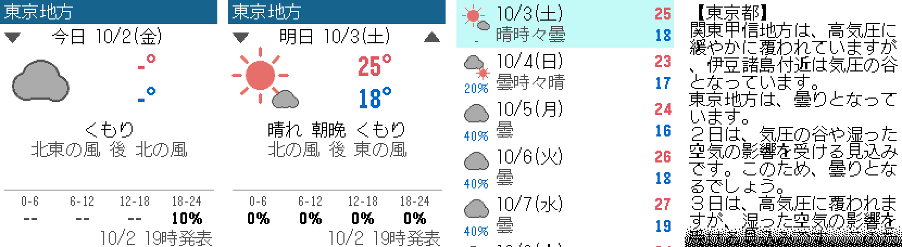
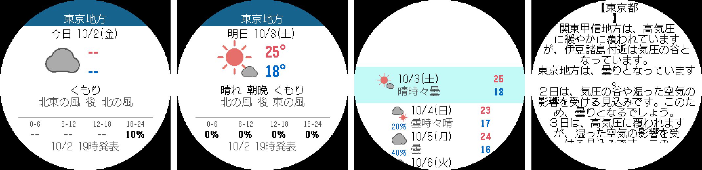
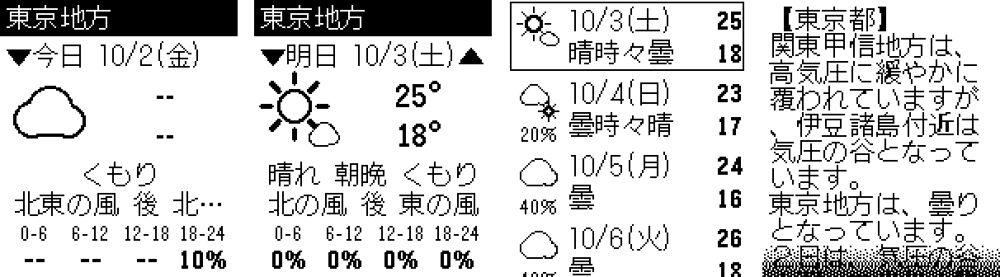

# 気象庁天気 (Pebble / Pebble Time 2)

気象庁ホームページの防災情報 JSON (`www.jma.go.jp/bosai/forecast/`) から天気予報を取得して、
Pebble に日本語で表示するウォッチアプリです。Pebble Time 2 (emery) を主な対象にしています。



## 機能

- 今日・明日・明後日の天気 (アイコン・天気文・最高/最低気温・6時間ごとの降水確率・風)
- 週間予報 (7日分の天気・降水確率・気温)
- 天気概況 (気象庁の解説文)
- 地域の選択: 全国 56 の府県予報区 × 一次細分区域、または GPS で現在地に近い地域を自動選択
- 30 分ごとに自動更新、前回のデータを起動直後に表示

## 操作

| ボタン | 動作 |
| --- | --- |
| 上 / 下 | 今日 ⇔ 明日 ⇔ 明後日 |
| 選択 | 週間予報 |
| 選択 長押し | 天気概況 |
| 上 長押し | 再読み込み |

地域の設定は、スマホの Pebble アプリでこのアプリの「設定」(歯車) から行います。

## 対応機種

| プラットフォーム | 機種 |
| --- | --- |
| emery | Pebble Time 2 |
| basalt / chalk | Pebble Time / Time Round |
| diorite / flint | Pebble 2 / Pebble 2 Duo |
| gabbro | Pebble Round 2 |

aplite (初代 Pebble) は日本語フォントがリソース容量に収まらないため非対応です。

| 丸型 (gabbro) | 白黒 (diorite) |
| --- | --- |
|  |  |

## インストール

ビルド済みの `release/jma-weather.pbw` をスマホに送り、Pebble アプリで開くとインストールできます。

自分でビルドする場合:

```bash
pip install pebble-tool   # または uv tool install pebble-tool
pebble sdk install latest
pebble build
pebble install --phone <スマホのIP>     # 実機
pebble install --emulator emery         # エミュレータ
```

## 仕組み

- `src/pkjs/index.js` (スマホ側): 予報 JSON `forecast/{府県予報区}.json` と概況 `overview_forecast/{府県予報区}.json` を取得し、
  選んだ地域の天気・気温・降水確率・週間予報を取り出して AppMessage でウォッチに送ります。
- `src/c/jma_weather.c` (ウォッチ側): 受け取ったデータを描画します。天気アイコンは天気コードから
  「晴/曇/雨/雪 + 時々・のち + 雷」を判定してベクター描画しています。
- `src/pkjs/areas.js`: 予報区・気温観測点・週間予報区域の対応表と、天気コード → 天気名の表。
  `python3 tools/gen_areas.py` で気象庁の定数 JSON から作り直せます。

## フォント

日本語表示に [DotGothic16](https://github.com/fontworks-fonts/DotGothic16) (SIL Open Font License 1.1,
`resources/fonts/OFL.txt`) を、JIS 第 1 水準漢字 + かな・記号 + 気象庁データに出てくる文字 (約 3,500 字) に絞って
同梱しています。作り直す手順は `tools/make_font.py` を参照してください。

## データの出典

出典: 気象庁ホームページ (https://www.jma.go.jp/)。
気象庁のコンテンツは [気象庁ホームページの利用規約](https://www.jma.go.jp/jma/kishou/info/coment.html) に従って利用しています。
このアプリは気象庁の公式アプリではありません。
